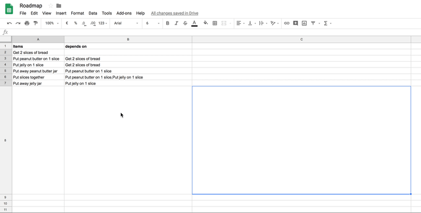

Insert a dependency graph in Google Sheets (custom formula)
============================================================

[](https://codecov.io/gh/image-charts/google-sheets-add-on-dependency-graph) [](https://circleci.com/gh/image-charts/google-sheets-add-on-dependency-graph)

# What is is?

Dependency graph is a Google Apps add-ons for Google Sheet that display beautiful dependency image graphs generated with [Image-Charts](https://www.image-charts.com/?google-sheets-add-on-dependency-graph).

- [🤩 Demo](https://docs.google.com/spreadsheets/d/1xucvdzTcDqMYAgL2wAS0UpARWyHyz9-_ratqyLZKeME/edit#gid=0)
- [📹 Screencast](https://www.youtube.com/watch?v=2T6oHo7FVdI)

<p align="center">
<a href="https://www.youtube.com/watch?v=2T6oHo7FVdI"></a>
</p>

# Usage

- Open your spreadsheet
- Menu `Add-ons` > Get `add-ons` > [Find this add-on](https://chrome.google.com/webstore/detail/bainjkfkhoipphfdlnlcnoddiggamjpd/)
- use it ([screencast](https://www.youtube.com/watch?v=2T6oHo7FVdI)) `=image(DEPENDENCY_GRAPH_URL(B2:B23; F2:F23; "ortho"); 2)`

# The story

> We've built a roadmap on google spreadsheet but now we can't find a way to visualize the whole dependency graph 😥

> [Hold my beer](https://twitter.com/FGRibreau/status/1041782155364446208).


# Add-on development

### Setup

- Enable Apps Script API: https://script.google.com/home/usersettings
- `npm install`
- `npm run first-run` to setup clasp

### Deploy on Google App Scripts

```
npm run deploy
```


Title: Dependency graph visualization
Short description: Sheet add-on that display beautiful dependency image graphs to visualize project roadmap or anything else that has dependencies.

Add-on Type: Sheets
Help url: https://www.youtube.com/watch?v=2T6oHo7FVdI
Report issue url: https://stackoverflow.com/questions/tagged/image-charts
Post-install tip: Use the =DEPENDENCY_GRAPH_URL() formula

Detailed description: A Google Sheet add-on that display beautiful dependency image graphs. Perfect for project roadmap, visualizing multiple dependencies, mind-map, etc...

### Resources

- https://developers.google.com/gsuite/add-ons/overview
- https://github.com/gsuitedevs/apps-script-samples
- https://stackoverflow.com/a/37056733/745121
- https://github.com/oshliaer/google-apps-script-awesome-list
- https://github.com/fossamagna/gasify
